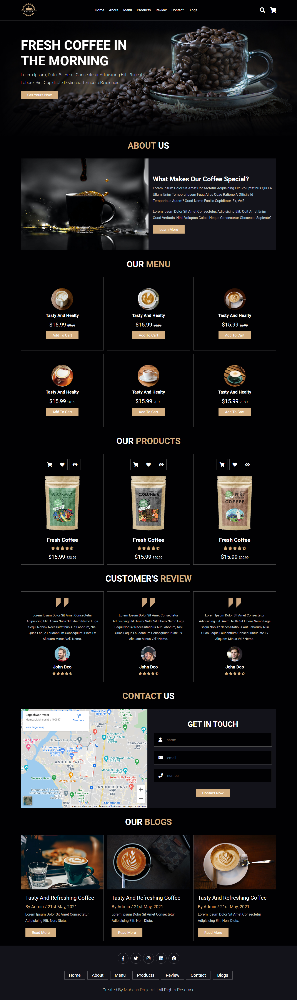

# Coffee Landing Page Template Design using by Html Css JavaScript

## Template Features:-

## <a href="https://mahesh-coffee-website.netlify.app/"> LIVE DEMO</a>

## *** Main Features  *** 

1. Fully Responsive Layout
3. Clean Code
4. Html5 & Css3
5. 100% Customizable, all colors can be customized
6. Font Awesome Icons
7. Google Fonts

## ***  Credits ***

1. freepik
2. pexels
3. Google Fonts 
4. Font Awesome

## All Template Section Name

### Header Section

### Home Section

### About Section

### Menu Section

### Products Section

### Review Section

### Contact Section

### Blogs Section

### Footer Section

  <b>Design Create by <a href="https://github.com/Maheshkumarprajapat">Abhishek Saini</a></b>

